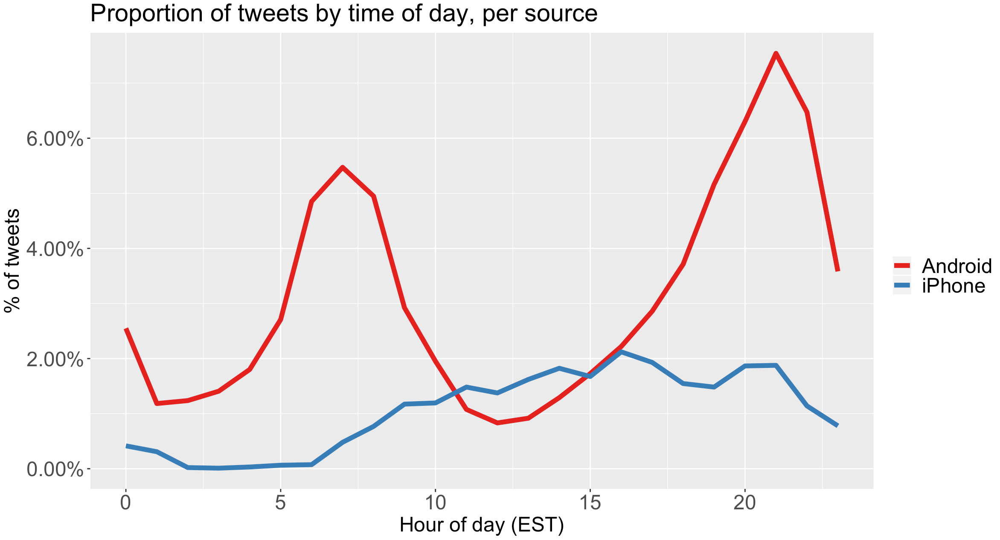

# Turning Tweets into Knowledge
Classifier for Trump's tweets to determine whether they are written by Trump himself or his staff.


### Structure:
The analysis has 3 main components.
1) <b>Importing raw data:</b> Imports unstructured text in "raw" form directly from an online source. 
2) <b>Preprocessing:</b> Transforms the raw data into a structured dataset amenable for analysis; a dependent variable and independent variables.
3) <b>Modeling:</b> Builds predictive models using the transformed dataset.

The codes for 'Importing raw data' is included in <a href="data_import.R" target="_blank">data_import.R</a>. The second and third components are in <a href="tweets_analysis.R" target="_blank">tweets_analysis.R</a>.

In this page, the analytical processes are described in smaller subsets as below.

1. Data Importation and Statistics
2. Text Preprocessing
3. Training and Testing
4. Prediction
5. Prediction (+ Metadata)
6. Prediction (+ Metadata & Sentiment Analysis)
<br/><br/>


## 1. Data Importation and Statistics
The dataset containing tweets and their metadata from the Trump's twitter account is imported from an online archive at <a href="http://www.trumptwitterarchive.com">http://www.trumptwitterarchive.com</a>.
```bash
### Data importation
url <- 'http://www.trumptwitterarchive.com/data/realdonaldtrump/%s.json'
all_tweets <- map(2009:2017, ~sprintf(url, .x)) %>%
  map_df(jsonlite::fromJSON, simplifyDataFrame = TRUE) %>%
  mutate(created_at = parse_date_time(created_at, "a b! d! H!:M!:S! z!* Y!")) %>%
  tbl_df()
```

#### Raw dataset


The analysis is restricted on the tweets uploaded via iPhone or Android.

```bash
### Restriction to Twitter data and definition of iPhone/Android fields
tweets <- all_tweets %>%
  select(id_str, source, text, created_at) %>%
  filter(source %in% c("Twitter for iPhone", "Twitter for Android")) %>%
  mutate(source = ifelse(source=="Twitter for iPhone", "iPhone", source)) %>%
  mutate(source = ifelse(source=="Twitter for Android", "Android", source))

### Restriction to the period of interest
tweets <- tweets %>%
  filter(created_at < "2017-03-01" & created_at > "2015-06-01")
```

#### Filtered dataset (n=7,114)


### Descriptive statistics
Now let's look at some descriptive statistics of tweets to get some preliminary insights. Below is the proportional patterns of tweets uploaded by iPhone vs. Android during the period of 2015 to 2016.

<b>Hypothesis:</b> During the 2016 campaign, Trump used an Android and his staff used iPhones. Then in March 2017, for security reasons, Trump switched to an iPhone.

```bash
### Descriptive plots at the aggregate level
tweets %>% filter(year(with_tz(created_at, "EST"))>2014, year(with_tz(created_at, "EST"))<2017) %>%
  count(source, hour = hour(with_tz(created_at, "EST"))) %>%
  mutate(percent = n / sum(n)) %>%
  ggplot(aes(hour, percent, color = source)) +
  geom_line(lwd=2) +
  scale_y_continuous(labels = percent_format()) +
  theme(title=element_text(size=18),axis.title=element_text(size=18), axis.text=element_text(size=18),legend.text=element_text(size=18)) +
  labs(title="Proportion of tweets by time of day, per source",
       x = "Hour of day (EST)",
       y = "% of tweets",
       color = "") +
  scale_color_brewer(palette="Set1")
```

#### Proporation of tweets


Let's look at the number of tweets starting with a quotation mark (")
```bash
tweets %>%
  count(source,
        quoted = ifelse(str_detect(text, '^"'), "Quoted", "Not quoted")) %>%
  ggplot(aes(source, n, fill = quoted)) +
  geom_bar(stat = "identity", position = "dodge") +
  theme(title=element_text(size=18),axis.title=element_text(size=18), axis.text=element_text(size=18),legend.text=element_text(size=18)) +
  labs(x = "", y = "Number of tweets", fill = "") +
  ggtitle('Whether tweets start with a quotation mark (")') +
  scale_fill_brewer(palette="Dark2")
```

#### Number of quoted tweets


</br>

#### Word frequencies used on Andriod vs. iPhone. <br/>


<br>

## 2. Text Preprocessing

Preprocessing the text in the corpus according to the following steps.
1. Change all the text to lower case.  
2. Transform "https://link" to ensure https is a word
3. Remove punctuation
4. Remove stop words and particular words. 
5. "Stem" the documents. 
6. Remove infrequent words. 

```bash
# 1. Everything in lower case
corpus = tm_map(corpus, tolower)

# 2. Transform "https://link" into "https link" to make sure https is a word
f <- content_transformer(function(x, oldtext,newtext) gsub(oldtext, newtext, x))
corpus <- tm_map(corpus, f, "https://", "http ")

# 3. Remove punctuation
corpus <- tm_map(corpus, removePunctuation)

# 4. Remove stop words and other particular words manually
corpus = tm_map(corpus, removeWords, stopwords("english"))
corpus = tm_map(corpus, removeWords, c("realdonaldtrump", "donaldtrump"))

# 5. Stemming
corpus = tm_map(corpus, stemDocument)

# 6. Sparsifying: find high-frequency words and remove uncommon words
frequencies = DocumentTermMatrix(corpus)
findFreqTerms(frequencies, lowfreq=200)
sparse = removeSparseTerms(frequencies, 0.99)
```


|Original|
|:--------|
|[1] "Merry Christmas &amp; Happy Holidays! #MakeAmericaGreatAgain #Trump2016 https://t.co/XIVw5LdTqv" |
|[2] "https://t.co/Sqim2YyoCH"   |

|Preprocessed|
|:--------|
|[1] "merri christma amp happi holiday makeamericagreatagain trump2016 http tcoxivw5ldtqv http"|
|[2] "tcosqim2yyoch"   |

<br>

## 3. Training and Testing

First, let's add the dependent variable that we are trying to predict here; whether Trump wrote the tweet or not. Then, we split the dataset into train and test sets based on the time splitting point of "2016-06-01".

```bash
### Add dependent variable into dataset

# Creation dataset and importation of dependent variable
documentterms = as.data.frame(as.matrix(sparse))
documentterms$TrumpWrote = trump.tweets$TrumpWrote

# Putting the dependent variable in first place
col_idx <- grep("TrumpWrote", names(documentterms))
documentterms <- documentterms[, c(col_idx, (1:ncol(documentterms))[-col_idx])]

### Splitting into training and test set
split1 = (trump.tweets$created_at < "2016-06-01")
split2 = (tweets.trump$created_at >= "2016-06-01")
train = documentterms[split1,]
test = documentterms[split2,]
```
<br>

## 4. Prediction

#### Baseline
The baseline predicts that all tweets are coming from Trump himself.

```bash
##### Baseline

accuracy.baseline = sum(test$TrumpWrote)/nrow(test)
TPR.baseline = 1
FPR.baseline = 1
AUC.baseline = .5

```

<table>
  <tr align='center' style="font-weight:bold">
    <td></td>
    <td>Accuracy</td>
    <td>TPR</td>
    <td>FPR</td>
    <td>AUC</td>
  </tr>
  <tr align='center'>
    <td style='font-weight:bold'>Baseline</td>
    <td>0.472</td>
    <td>1</td>
    <td>1</td>
    <td>0.5</td>
  </tr>
</table>
<br>

#### Logistic Regression


```bash
### Logistic regression

logreg = glm(TrumpWrote ~., data=train, family="binomial")
summary(logreg)

predictions.logreg <- predict(logreg, newdata=test, type="response")
matrix.logreg = table(test$TrumpWrote, predictions.logreg > 0.5)
accuracy.logreg = (matrix.logreg[1,1]+matrix.logreg[2,2])/nrow(test)
TPR.logreg = (matrix.logreg[2,2])/sum(matrix.logreg[2,])
FPR.logreg = (matrix.logreg[1,2])/sum(matrix.logreg[1,])

ROC.logreg <- prediction(predictions.logreg, test$TrumpWrote)
ROC.logreg.df <- data.frame(fpr=slot(performance(ROC.logreg, "tpr", "fpr"),"x.values")[[1]],tpr=slot(performance(ROC.logreg, "tpr", "fpr"),"y.values")[[1]])
AUC.logreg <- performance(ROC.logreg, "auc")@y.values[[1]]

```


<table>
  <tr align='center' style="font-weight:bold">
    <td></td>
    <td>Accuracy</td>
    <td>TPR</td>
    <td>FPR</td>
    <td>AUC</td>
  </tr>
  <tr align='center'>
    <td style='font-weight:bold'>Logistic</td>
    <td>0.768</td>
    <td>0.945</td>
    <td>0.391</td>
    <td>0.844</td>
  </tr>
</table>
<br>


#### CART

```bash
### CART

cart = rpart(TrumpWrote ~ ., data=train, method="class", cp = .003)


prp(cart, digits=3, split.font=1, varlen = 0, faclen = 0)

predictions.cart <- predict(cart, newdata=test, type="class")
matrix.cart = table(test$TrumpWrote, predictions.cart)
accuracy.cart = (matrix.cart[1,1]+matrix.cart[2,2])/nrow(test)
TPR.cart = (matrix.cart[2,2])/sum(matrix.cart[2,])
FPR.cart = (matrix.cart[1,2])/sum(matrix.cart[1,])

ROC.cart<- prediction(predict(cart, newdata=test)[,2], test$TrumpWrote)
ROC.cart.df <- data.frame(fpr=slot(performance(ROC.cart, "tpr", "fpr"),"x.values")[[1]],tpr=slot(performance(ROC.cart, "tpr", "fpr"),"y.values")[[1]])
AUC.cart <- as.numeric(performance(ROC.cart, "auc")@y.values)

```

<br>

<table>
  <tr align='center' style="font-weight:bold">
    <td></td>
    <td>Accuracy</td>
    <td>TPR</td>
    <td>FPR</td>
    <td>AUC</td>
  </tr>
  <tr align='center'>
    <td style='font-weight:bold'>CART</td>
    <td>0.823</td>
    <td>0.962</td>
    <td>0.301</td>
    <td>0.863</td>
  </tr>
</table>
<br>


#### Random Forest

```bash
### Random Forest

train$TrumpWrote = as.factor(train$TrumpWrote)
test$TrumpWrote = as.factor(test$TrumpWrote)

set.seed(123)
rfmodel = randomForest(TrumpWrote ~., data=train)

importance.rf <- data.frame(imp=round(importance(rfmodel)[order(-importance(rfmodel)),],2))

predictions.RF = predict(rfmodel, newdata=test)
matrix.RF = table(test$TrumpWrote, predictions.RF)
accuracy.RF = (matrix.RF[1,1]+matrix.RF[2,2])/nrow(test)
TPR.RF = (matrix.RF[2,2])/sum(matrix.RF[2,])
FPR.RF = (matrix.RF[1,2])/sum(matrix.RF[1,])

ROC.RF<- prediction(predict(rfmodel,newdata=test,type="prob")[,2], test$TrumpWrote)
ROC.RF.df <- data.frame(fpr=slot(performance(ROC.RF, "tpr", "fpr"),"x.values")[[1]],tpr=slot(performance(ROC.RF, "tpr", "fpr"),"y.values")[[1]])
AUC.RF <- as.numeric(performance(ROC.RF, "auc")@y.values)

```


<table>
  <tr align='center' style="font-weight:bold">
    <td></td>
    <td>Accuracy</td>
    <td>TPR</td>
    <td>FPR</td>
    <td>AUC</td>
  </tr>
  <tr align='center'>
    <td style='font-weight:bold'>Random Forest</td>
    <td>0.781</td>
    <td>0.97</td>
    <td>0.389</td>
    <td>0.84</td>
  </tr>
</table>


#### Summary of performance

<br><br>
<table>
  <tr align='center' style="font-weight:bold">
    <td></td>
    <td>Accuracy</td>
    <td>TPR</td>
    <td>FPR</td>
    <td>AUC</td>
  </tr>
  <tr align='center'>
    <td style='font-weight:bold'>Baseline</td>
    <td>0.781</td>
    <td>0.97</td>
    <td>0.389</td>
    <td>0.84</td>
  </tr>
  <tr align='center'>
    <td style='font-weight:bold'>Logistic Regression</td>
    <td>0.768</td>
    <td>0.945</td>
    <td>0.391</td>
    <td>0.844</td>
  </tr>
  <tr align='center'>
    <td style='font-weight:bold'>CART</td>
    <td>0.823</td>
    <td>0.962</td>
    <td>0.301</td>
    <td>0.863</td>
  </tr>
  <tr align='center'>
    <td style='font-weight:bold'>Random Forest</td>
    <td>0.781</td>
    <td>0.97</td>
    <td>0.389</td>
    <td>0.84</td>
  </tr>
</table>


## 5. Prediction (+ Metadata)
The prediction accuracy can be improved by adding metadata of tweets. 
1. <b>Picture/video/link:</b> The importance of 'http' as a word was shown in the constructed CART tree above. We can create a variable that indicates whether the tweet has a picture/video/link
2. <b>Hour of the day:</b> Trump and his staff tweet in different hours of the day. We can create a variable for the hour of the day the tweet was create.
3. <b>Number of #, @:</b> We can add twitter-specific variables such as number of #hastags and @mentions used in the tweet.
4. <b>Length of tweet:</b> We can add the length of tweet.

```bash
##### ADD METADATA

# Add for presence of picture  
tweets.trump = tweets.trump %>%
  mutate(pic_link = ifelse(str_detect(text, "t.co"),1,0))
# Add tweet length
tweets.trump = tweets.trump %>%
  mutate(length = nchar(text))
# Add hour of day
tweets.trump = tweets.trump %>%
  mutate(hour = hour(with_tz(created_at, "EST")))
# Add number of hashtags
tweets.trump = tweets.trump %>%
  mutate(hashtag = str_count(text, "#"))
# Add number of @mentions
tweets.trump = tweets.trump %>%
  mutate(mentions = str_count(text, "@"))
```

#### CART Tree


We can see the importance of Metadata variables from the constructed CART tree above.


#### Summary of performance with Metadata

<br><br>

<table>
  <tr align='center' style="font-weight:bold">
    <td></td>
    <td>Accuracy</td>
    <td>TPR</td>
    <td>FPR</td>
    <td>AUC</td>
  </tr>
  <tr align='center'>
    <td style='font-weight:bold'>Logistic</td>
    <td>0.768</td>
    <td>0.945</td>
    <td>0.391</td>
    <td>0.844</td>
  </tr>
  <tr align='center' bgcolor="grey">
    <td style='font-weight:bold'>Logistic+Metadata</td>
    <td>0.814</td>
    <td>0.906</td>
    <td>0.267</td>
    <td>0.896</td>
  </tr>
  <tr align='center'>
    <td style='font-weight:bold'>CART</td>
    <td>0.823</td>
    <td>0.962</td>
    <td>0.301</td>
    <td>0.863</td>
  </tr>
  <tr align='center' bgcolor="grey">
    <td style='font-weight:bold'>CART+Metadata</td>
    <td>0.849</td>
    <td>0.964</td>
    <td>0.253</td>
    <td>0.914</td>
  </tr>
  <tr align='center'>
    <td style='font-weight:bold'>Random Forest</td>
    <td>0.781</td>
    <td>0.97</td>
    <td>0.389</td>
    <td>0.84</td>
  </tr>
  <tr align='center' bgcolor="grey">
    <td style='font-weight:bold'>Random Forest+Metadata</td>
    <td>0.848</td>
    <td>0.99</td>
    <td>0.279</td>
    <td>0.848</td>
  </tr>
</table>
<br>

## 6. Prediction (+ Metadata & Sentiment Analysis)

We can extract sentiment information from the tweet. Below are some examples that show the sentiments extracted from the uploaded tweets.
<table>
  <tr align='center' style="font-weight:bold">
    <td></td>
    <td>Tweet</td>
    <td>Sentiment</td>
  </tr>
  <tr align='center'>
    <td>1</td>
    <td>A GREAT day in South Carolina. Record crowd and fantastic enthusiasm. This is now a movement to MAKE AMERICA GREAT AGAIN!</td>
    <td>anticipation, joy, positive, surprise</td>
  </tr>
  <tr align='center'>
    <td>2</td>
    <td>Do you believe that The State Department, on NEW YEAR'S EVE, just released more of Hillary's e-mails. They just want it all to end. BAD!</td>
    <td>anger, disgust, fear, negative, sadness</td>
  </tr>
</table>

To do this, we need the sentiment mapping that lists the words and corresponding sentiments. Here I used the NRC Word-Emotion Association lexicon from https://saifmohammad.com/WebPages/lexicons.html. Use "Non-commercial Research Use" option.

#### Sentiment mapping


### Import Sentiment Map
The sentiment map from NRC Word-Emotion Association lexicon provides mapping of total 6,468 words to 10 correspoding sentiments:
* anger, anticipation, disgust, fear, joy, negative, positive, sadness, surprise, trust

 We then index the map into 0 or 1 to make it amenable to train and test.

```bash
nrc <- read.csv('NRC-Emotion-Lexicon-Wordlevel-v0.92.csv', header=FALSE)
colnames(nrc) <- c('word', 'sentiment', 'indicator')
nrc <- nrc %>%
  filter(indicator==1) %>%
  dplyr::select(word, sentiment)

nrc_wide <- dcast(nrc, word ~ sentiment)

# convert nrc wide to be 0 and 1 values
nrc_wide$anger = ifelse(is.na(nrc_wide$anger),0,1)
nrc_wide$anticipation = ifelse(is.na(nrc_wide$anticipation),0,1)
nrc_wide$disgust = ifelse(is.na(nrc_wide$disgust),0,1)
nrc_wide$fear = ifelse(is.na(nrc_wide$fear),0,1)
nrc_wide$joy = ifelse(is.na(nrc_wide$joy),0,1)
nrc_wide$negative = ifelse(is.na(nrc_wide$negative),0,1)
nrc_wide$positive = ifelse(is.na(nrc_wide$positive),0,1)
nrc_wide$sadness = ifelse(is.na(nrc_wide$sadness),0,1)
nrc_wide$surprise = ifelse(is.na(nrc_wide$surprise),0,1)
nrc_wide$trust = ifelse(is.na(nrc_wide$trust),0,1)
nrc_wide
```

#### Original


#### Indexed


#### Join sentiment

Before moving on to the training and testing stage, we have to join the sentiment information with the previous dataset, which has the information on Outcome (TrumpWrote), Words, Metadata as shown below.


<br>

#### Logistic Regression

<table>
  <tr align='center' style="font-weight:bold">
    <td></td>
    <td>Accuracy</td>
    <td>TPR</td>
    <td>FPR</td>
    <td>AUC</td>
  </tr>
  <tr align='center'>
    <td style='font-weight:bold'>Logistic</td>
    <td>0.768</td>
    <td>0.945</td>
    <td>0.391</td>
    <td>0.844</td>
  </tr>
  <tr align='center'>
    <td style='font-weight:bold'>Logistic+Metadata</td>
    <td>0.814</td>
    <td>0.906</td>
    <td>0.267</td>
    <td>0.896</td>
  </tr>
  <tr align='center' bgcolor="grey">
    <td style='font-weight:bold'>Logistic+Metadata+Sentiment</td>
    <td>0.819</td>
    <td>0.900</td>
    <td>0.253</td>
    <td>0.903</td>
  </tr>
</table>


#### CART

As shown below, we can see 'positive', 'negative', 'joy', 'trust' are sentiment information that have important influence on the outcome.


<table>
  <tr align='center' style="font-weight:bold">
    <td></td>
    <td>Accuracy</td>
    <td>TPR</td>
    <td>FPR</td>
    <td>AUC</td>
  </tr>
  <tr align='center'>
    <td style='font-weight:bold'>CART</td>
    <td>0.823</td>
    <td>0.962</td>
    <td>0.301</td>
    <td>0.863</td>
  </tr>
  <tr align='center'>
    <td style='font-weight:bold'>CART+Metadata</td>
    <td>0.849</td>
    <td>0.964</td>
    <td>0.253</td>
    <td>0.914</td>
  </tr>
  <tr align='center' bgcolor="grey">
    <td style='font-weight:bold'>CART+Metadata+Sentiment</td>
    <td>0.868</td>
    <td>0.963</td>
    <td>0.217</td>
    <td>0.902</td>
</table>


<br>

#### Random Forest

<table>
  <tr align='center'>
    <td style='font-weight:bold'>Random Forest</td>
    <td>0.781</td>
    <td>0.97</td>
    <td>0.389</td>
    <td>0.84</td>
  </tr>
  <tr align='center'>
    <td style='font-weight:bold'>RF+Metadata</td>
    <td>0.848</td>
    <td>0.99</td>
    <td>0.279</td>
    <td>0.848</td>
  </tr>
  <tr align='center' bgcolor="grey">
    <td style='font-weight:bold'>RF+Metadata+Sentiment</td>
    <td>0.869</td>
    <td>0.986</td>
    <td>0.235</td>
    <td>0.946</td>
  </tr>
</table>
<br>


## Recap

Basic procedural steps for text analytics: bag of words
* Raw data: Transform unstructured text into structured, amenable data form
* Metadata: Include metadata that are considered important in determining the outcome, e.g. length of tweet, uploaded time, picture/video/link, etc.
* Sentiment: Mapping of words into sentiments contributes in improving the prediction performance
